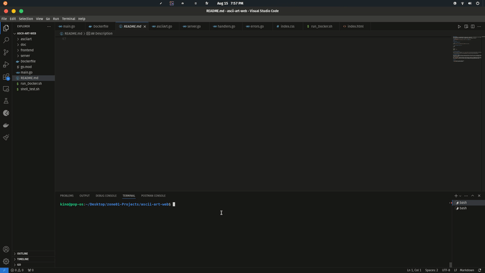

# Stanley's ASCII Studio

Stanley's ASCII Studio is a Go web app for turning regular text into ASCII art. It includes multiple banner styles, a live result panel, font previewing, downloads, clipboard copy, and a custom light/dark interface.

<div align="center">
  
</div>

## Features

- Generate ASCII art from text input.
- Choose from the bundled banner fonts.
- Preview the same text across every available font.
- Download generated ASCII art as a text file.
- Copy the result directly from the browser.
- Switch between light and dark mode.
- Branded UI and project links for [Stanley-0ps](https://github.com/Stanley-0ps).

## Getting Started

Clone the repository:

```bash
git clone https://github.com/Stanley-0ps/ascii-art-web.git
cd ascii-art-web
```

Run the app:

```bash
go run .
```

Open the app in your browser:

```text
http://127.0.0.1:8088
```

You can also build and run the binary:

```bash
go build -o asciiWeb .
./asciiWeb
```

## Configuration

The server uses port `8088` by default. You can override it with the `PORT` environment variable:

```bash
PORT=3000 go run .
```

There is also a `STYLE` environment variable for switching to the alternate template:

```bash
STYLE=K go run .
```

## Docker

Build the image:

```bash
docker build -t ascii-studio .
```

Run the container:

```bash
docker run --rm -p 8088:8088 ascii-studio
```

Then visit:

```text
http://127.0.0.1:8088
```

## Project Structure

```text
asciiart/              ASCII rendering logic and banner files
frontend/templates/    HTML templates
frontend/css/          App styles
server/                HTTP handlers and server setup
main.go                Embedded assets and app entry point
Dockerfile             Container build instructions
```

## Implementation Notes

`HomeHandler` renders the main page with the available banner fonts. `AsciiArtHandler` receives form submissions, generates the ASCII art with `asciiart.ASCIIArt`, then renders the result back into the page.

The preview action renders `preview.html` with every banner style, and the download action returns the generated ASCII output as a plain text file.

## Author

Built and customized by [Stanley-0ps](https://github.com/Stanley-0ps).

Project repository: [github.com/Stanley-0ps/ascii-art-web](https://github.com/Stanley-0ps/ascii-art-web)
